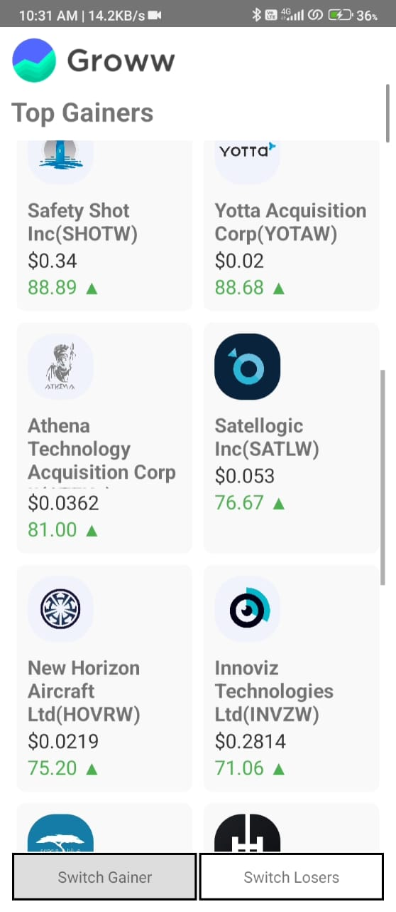
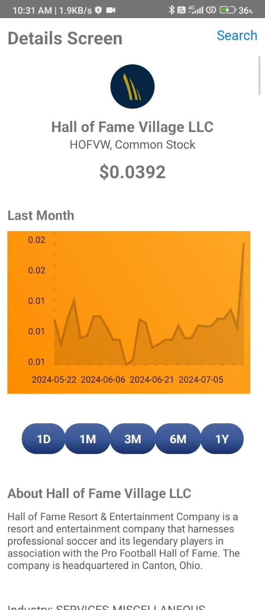
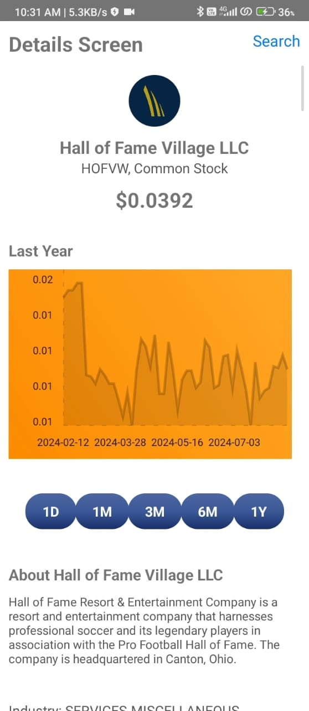

# 📈 Stock Market Trend Analyzer

Welcome to the **Stock Market Trend Analyzer** - a mobile application built with React Native that helps you stay ahead of the market by analyzing stock trends. Leverage the comprehensive data from Alpha Vantage and Finhub APIs to make informed investment decisions right from your smartphone.

## 🚀 Features

- **Real-Time Data**: Get up-to-date stock prices and market trends.
- **Historical Analysis**: Review historical data to understand long-term trends.
- **User-Friendly Interface**: Intuitive design for seamless navigation and data visualization.
- **Cache API Data**: Optimized to reduce API calls by caching data, ensuring efficient performance.

## 📊 APIs Used

- **Alpha Vantage**: Comprehensive stock market data.
- **Finhub**: Financial analysis.

## 🔧 Technologies

- **React Native**: For building the cross-platform mobile application.
- **Axios**: For making API calls.
- **React-Native Charts**: For rendering charts and visualizing data.

## 📱 Screenshots

### Home Screen 


!

### Details Screen





## 🌟 Get Started

1. **Clone the repository**: 
   ```sh
   git clone https://github.com/Satishg2606/Groww.git
